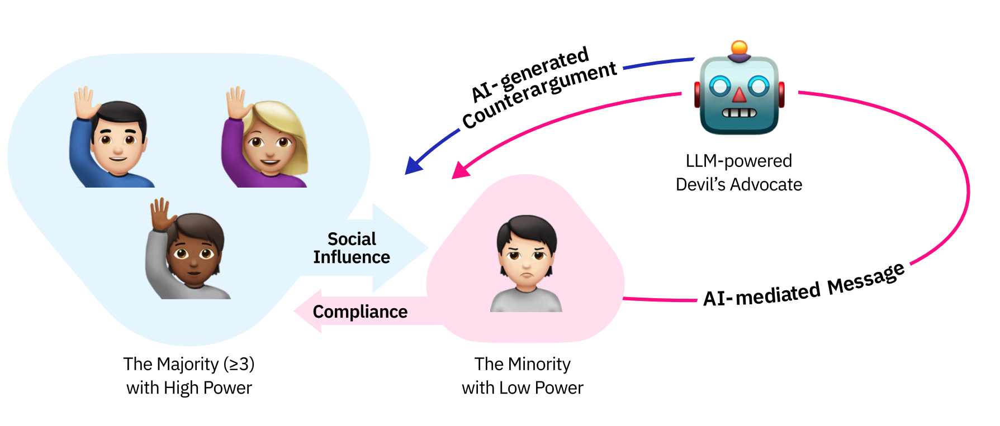

https://dl.acm.org/doi/10.1145/3708557.3716334

## Abstract

Group decision-making often benefits from diverse perspectives, yet power imbalances and social influence can stifle minority opinions and compromise outcomes. This prequel introduces an AI-mediated communication system that leverages the Large Language Model to serve as a devil’s advocate, representing underrepresented viewpoints without exposing minority members’ identities. Rooted in persuasive communication strategies and anonymity, the system aims to improve psychological safety and foster more inclusive decision-making. Our multi-agent architecture, which consists of a summary agent, conversation agent, AI duplicate checker, and paraphrase agent, encourages the group’s critical thinking while reducing repetitive outputs. We acknowledge that reliance on text-based communication and fixed intervention timings may limit adaptability, indicating pathways for refinement. By focusing on the representation of minority viewpoints anonymously in power-imbalanced settings, this approach highlights how AI-driven methods can evolve to support more divergent and inclusive group decision-making.

